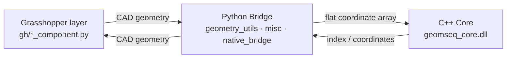
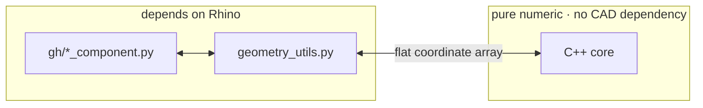

# Presentation notes

Working notes for a talk about this project (QA / software-architecture angle).
Slide text is in English; the commentary around it is for the speaker.

---

## Slide — Architecture

**Three-layer architecture**

- CAD layer (Rhino/GH) → Python layer (`geometry_utils.py`, does not import Rhino) → C++ core
- Only flat coordinate arrays cross the boundary
- Punchline: *"The C++ core doesn't know, and doesn't need to know, who is calling it"*
- Trade-off: the cost is flattening CAD objects into a coordinate array in Python
  (per-object attribute access), **not** the boundary crossing itself — the array
  is handed to C++ zero-copy via `from_buffer`.

**Visual** — keep it to three boxes. Collapsing `geometry_utils` / `misc` /
`native_bridge` into one "Python Bridge" box is what stops the diagram exploding;
the message lives in the arrow labels, not the box count.

Alternative, if the point is the testable boundary rather than the flow:

**Do not put on the slide:** that `sort_*` returns Rhino objects while the other
two return plain numbers. It is an implementation detail, and it makes the
audience wonder why there are two paths.

**If challenged — "it doesn't import Rhino, but doesn't it still depend on the
API?"** Yes: `misc.py` calls `PointAtStart` / `.X` / `Duplicate()` / `Reverse()`,
which is duck typing. That is the stronger answer, not a weaker one — it is
exactly why a 20-line `_Seg` stub can replace RhinoCommon in the tests.

---

## Slide — Function Overview

Two tables. Titles that stay at the same conceptual level:

| Table | Title | Subtitle |
|---|---|---|
| C++ | **Native core (C++)** | `geomseq_core/native/` |
| Python | **CAD-side helpers (Python)** | `rhino_utils/` |

"CAD-side" rather than "Rhino-side": `sample_curve_points.py` does not actually
import Rhino, so a Rhino-specific label leaves a hole.

**Native core** — four functions, matching the four exported symbols and the four
test files:

| Function | Purpose |
|---|---|
| `sort_curves` | Curve sequencing — direction-aware, emits reversal flags |
| `sort_points` | Point sequencing — no direction, simplified sibling of `sort_curves` |
| `redistribute_lookups` | Arc-length density redistribution (pure 1D, no kd-tree) |
| `build_turn_waypoints` | Smooth travel path between two segments, under a per-vertex turn cap |

**CAD-side helpers**:

| Function | Purpose |
|---|---|
| `DivideCurves` / `process_curve` | Curve → division points + continuous arc-length lookups; emits `corner_indices` |
| `sample_curve_points` | Arc-length lookups → points on the curve |

**Bullets**

- **Native core** — every function takes and returns flat coordinate arrays; no CAD type ever crosses the boundary.
- **CAD-side helpers** — curve evaluation needs to know what a NURBS curve *is*, so it can't be reduced to numbers. This logic stays in Python by design, not by omission.
- The boundary is what keeps extension cheap: a new native function is one `.cpp`, one ctypes signature, one wrapper — no existing code touched.
- *(optional closer)* Together they form one pipeline: `divide_curves` → `redistribute_lookups` → `sample_curve_points`, crossing the language boundary twice.

**Evidence for the third bullet** — adding `build_turn_waypoints` (the fourth
function) touched a new `.cpp`, +17 lines of `argtypes`, +54 lines of wrapper,
and a new GH component. `misc.py` was untouched and no existing function changed.

Prefer this evidence over claiming the architecture was "designed upfront for
extensibility" — that is a claim about intent, and it invites "how do you know
you didn't just get lucky?" Let the numbers imply the conclusion.

**`geometry2d` is gone** — removed in `50625ca` along with
`sort_points_no_crossing`. Do not list it.

---

## Slide — Core Algorithm: kd-tree + 2-opt

**Bullets**

- Two phases: greedy nearest-neighbour builds an initial path, then 2-opt uncrosses it by reversing sub-paths.
- nanoflann's kd-tree replaces the O(n²) neighbour scan — the greedy phase measures ≈ O(n^1.3).
- 2-opt is where the cost sits: ≈ O(n^2.2). For curve sorting above 10k, a windowed variant caps candidates at the 500 nearest edges.

**Table — "Cost of 2-opt"**

| n | 2-opt vs greedy |
|---|---|
| 1,000 | 11× |
| 8,000 | 63× |
| 64,000 | 425× |

*Caption:* Measured scaling — greedy ≈ O(n^1.3), 2-opt ≈ O(n^2.2)

Full data, method and a reproduction script: [benchmarks.md](benchmarks.md).

**Visual** — two 1k-point images, with and without 2-opt. They show *quality*
(greedy leaves crossings, 2-opt removes them), not speed: at 1k both are
milliseconds. The table then answers the obvious follow-up, "so why not always
run it."

**Accuracy trap:** the windowed 2-opt exists only in `sort_curves.cpp`, gated at
n > 10,000. `sort_points.cpp` — the example used here — has only the exhaustive
version, and a 1k demo would not reach the threshold anyway. Keep "windowed" as
a scaling footnote, not part of the main description.

**Verbal closer:** a converged 2-opt path is provably non-self-intersecting, so
the difference between the two images is a property of the algorithm, not luck.

---

## Slide — Testing & CI

**Properties, not exact values**

- Heuristic algorithms have no single correct output — so the tests assert what must hold for any valid result.
- Verified on three toolchains: MSVC, clang++ and g++ — same cases, same results.
- *(optional)* Runs on plain CPython — no Rhino, no CAD license in CI.

**Table — "What must hold"**

| Dimension | What it asserts | Why it matters |
|---|---|---|
| **Structural integrity** | Output is a permutation of input — right count, no duplicates, nothing dropped | An algorithm may reorder geometry, but must never lose or duplicate it |
| **Ordering invariants** | Strictly increasing; endpoints and named corners preserved exactly | Redistributing density must not smooth away positions that define the shape |
| **Distance non-worsening** | Sorted travel distance ≤ original order's | Shortening the path is the whole point; it must not come out worse |
| **Geometric constraints** | Step sizes within `[low, high]`; per-vertex turn ≤ `theta_max` \* | Output has to be physically traversable — no impossible turns |

\* within tested configurations; see caveat below

Summary line: **4 test files · 17 cases · plain CPython, no Rhino · run on every push**

This line does double duty — it also proves the architecture claim from the
Architecture slide, so the two slides corroborate each other.

**Third bullet answers a question the audience will otherwise ask:** "how do you
run Rhino in CI?" You don't — that is the payoff of the boundary.

---

## Honesty caveats — know these before presenting

**The turn-angle cap is not a universal invariant.** It holds inside each fillet
but not across the exit→entry junction, because the two fillets are built
independently and their endpoints need not meet along the chord. A stress run of
4,000 random configurations violated it 1,865 times, worst case 176° against a
`theta_max_deg` of 5. Reproducer: `E=(0,0)`, `a_vec=(1,0)`, `S=(10,0)`,
`b_vec=(-1,1)`, `theta_max_deg=30`, `step_len=2`, `extend_len=2` → 62° kink.

A green tick next to that row overclaims. Either footnote it or be ready to
explain — knowing where a property test's guarantee ends is a better signal than
a clean-looking checklist.

**"Identical results" means to the printed precision** (three decimals), not
bit-identical. `-O2` permits floating-point reassociation. Say "same numbers" or
"identical output" and the claim is airtight.

**Property tests cannot catch "valid but bad".** A result can be a correct
permutation, strictly monotonic, and still far from optimal. Worth volunteering —
it shows you know the method's limits.

**`rhino_utils/` does not fit the three-layer story cleanly.** It imports
RhinoCommon but is not a thin GH shell. One line if asked: RhinoCommon-dependent
logic complex enough to be worth reusing outside a component, not part of the
numeric core.

**CI covers three platforms, not four.** The Intel macOS runner was dropped —
GitHub no longer allocates them, so the job queued to the 24-hour limit and
cancelled. Update any "four platforms" claim. Intel is covered by building and
testing locally instead.

---

## Naming decisions already made

| Item | Chosen | Rejected, and why |
|---|---|---|
| Verification table | "What must hold" | "Test coverage" — implies line/branch coverage, invites a demand for percentages |
| Performance table | "Cost of 2-opt" | "Benchmark" — implies rigour the 1–2 repetition runs don't have |
| C++ table | "Native core (C++)" | Bare "Native" — native to what? |
| Python table | "CAD-side helpers" | "Rhino-side" — `sample_curve_points` doesn't import Rhino |
